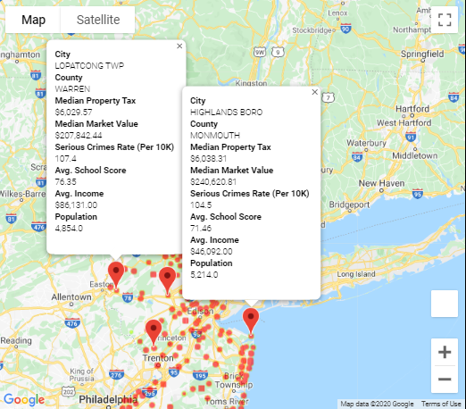
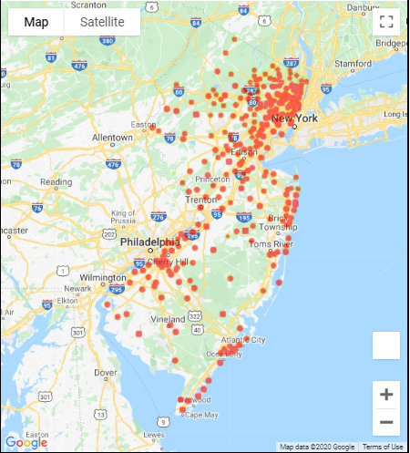
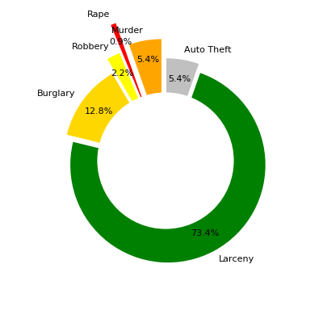
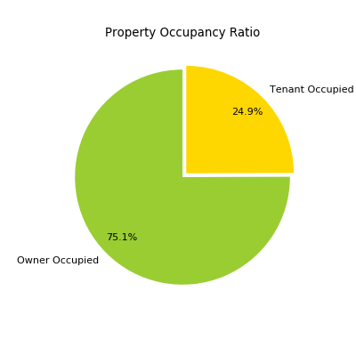
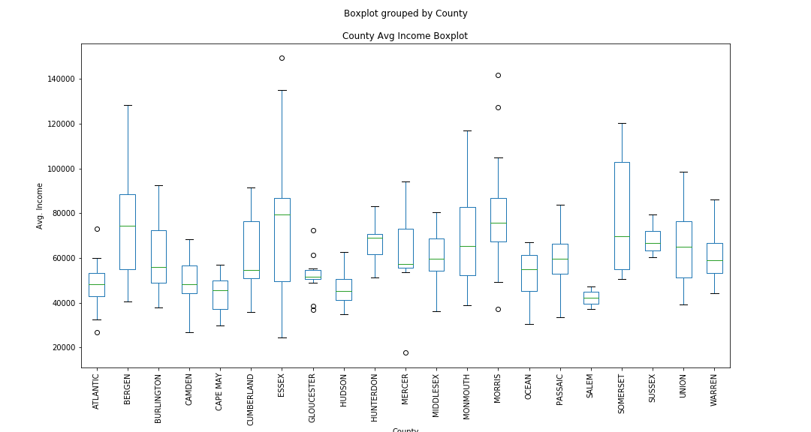
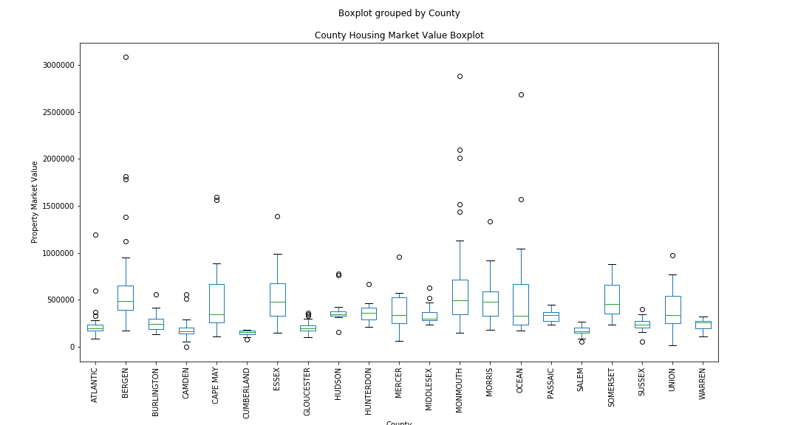
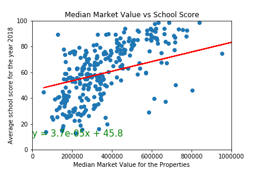
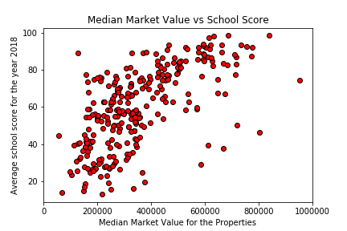
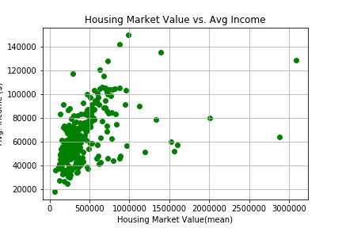
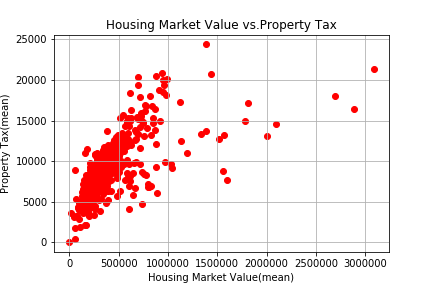

# NJ-Housing-2020 - Best places to raise family

# Background:

The purpose of this study is to compare the socio-economic factors and its impact on house price.  

## Instructions:

Tasks are to do the following:

## Data Source(s)
* Find the data sources for various socio-economic indocatiors -
    * Crime rate
    * Educational Ranking or Score
    * Median Income
    * Median Property Tax
    * Town Population 

## Data Analysis and Cleaning:
* Gather the data from various publicly available domain area
* Clen the data sets 
* Normalize data sets

## Visualization:
  * Generate a summary statistics
  * Generate plots using both Pandas's `DataFrame.plot()` and Matplotlib's `pyplot` for various data points. 
  * Generate google maps to show crime rate heat map
  * Show top five best townships to live on google map with appropriate information. 

## Summary Info:
  * Please see "Summary" folder for final notebook and "Final Summary Data" for all visualization output and summary table.

 

###### Copyright
#####  RUBC Team 9- 2020 All Rights Reserved.

